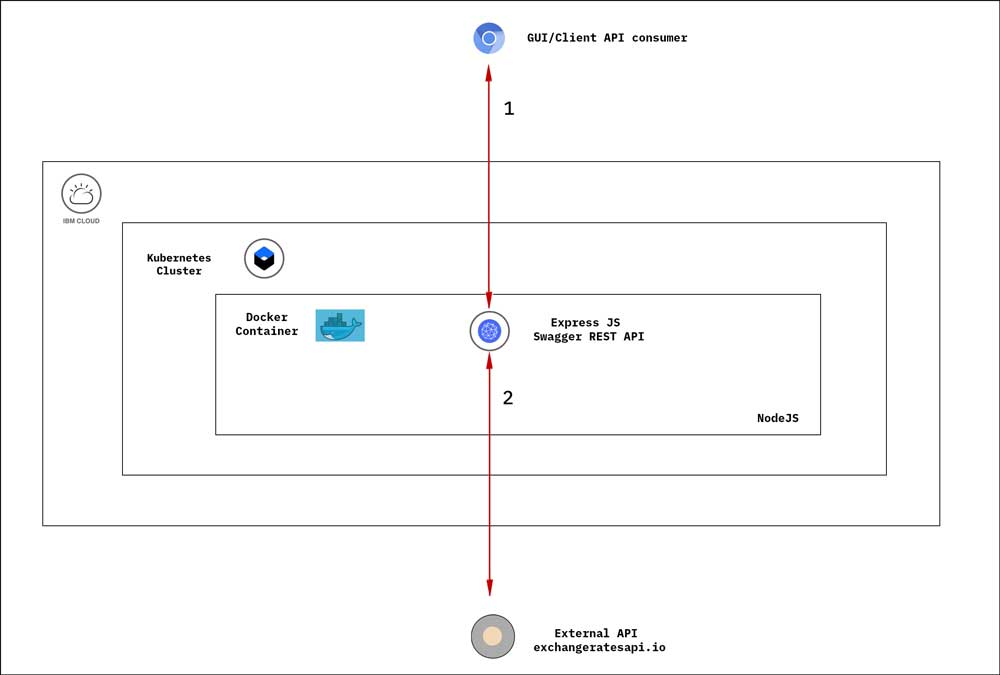
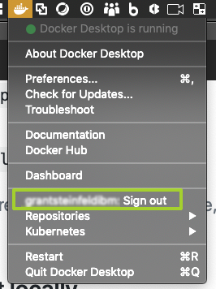
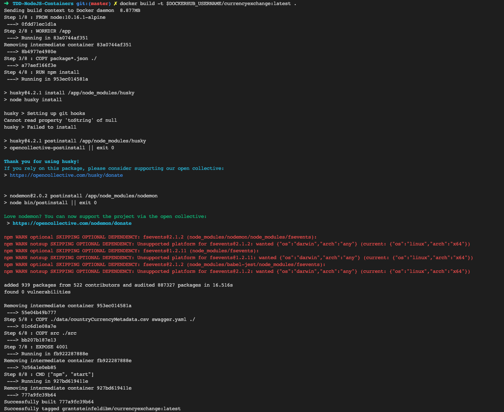
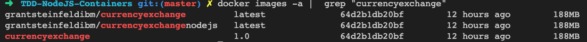
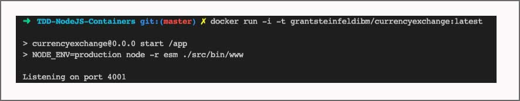
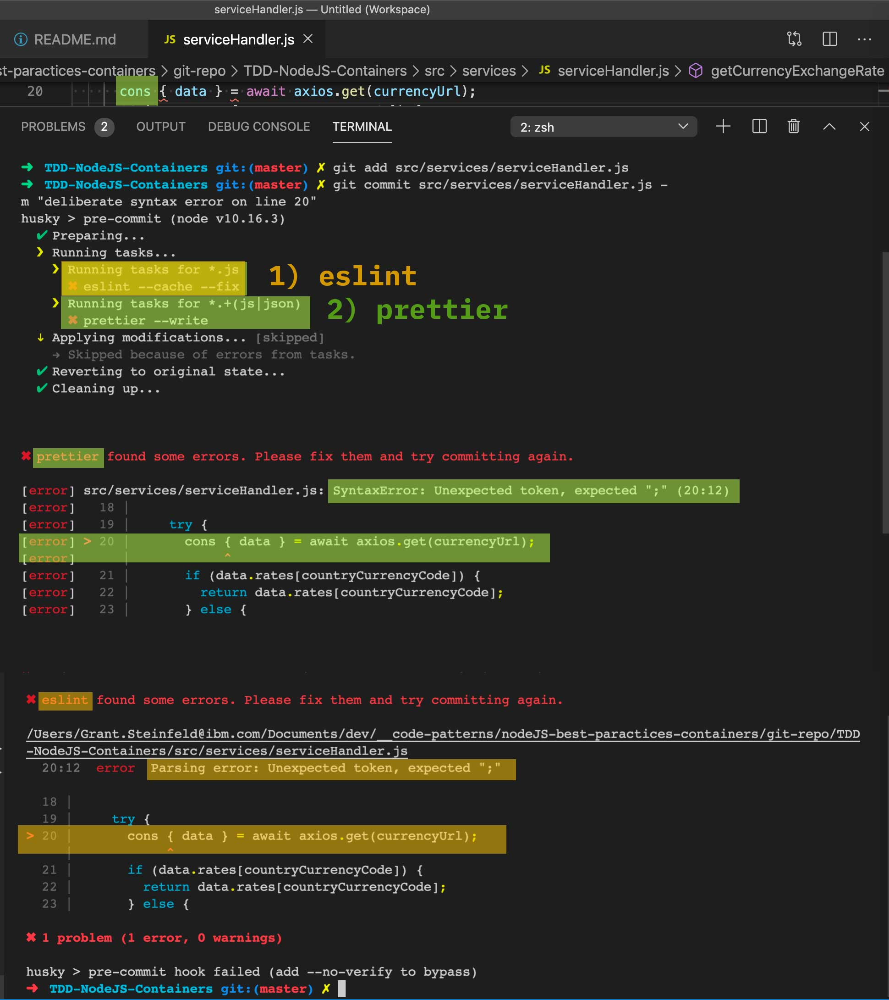

[](https://travis-ci.com/IBM/TDD-NodeJS-Containers)

# Currency Exchange - Best Practices building a world class Node.js microservice

This code pattern shows you how to create a world class currency conversion microservice in Node.js. This code pattern is a microservice that is a part of the [Bee Travels project](https://github.com/bee-travels).

This pattern showcases modern Node.js development by using modern JavaScript and popular `npm` libraries, which are listed in the [Anatomy of this Application](#anatomy-of-this-application) section at the bottom of this page. 

This application was created using test-driven development(TDD) methodologies, in particular the Red-Green-Refactor or test-first approach. No code was written without ***first*** writing an associated unit test.

Read our article [5 steps of test-driven development](https://developer.ibm.com/articles/5-steps-of-test-driven-development/) to get the background information on the TDD approach we used to create the currency exchange microservice in this code pattern.

Code that has unit tests is regarded as more complete and accurate. The unit tests function as a means to clearly understand the application. Requirements for the application translate into tests, so examining the tests gives you an idea about what the application does, and it also shows how to use the code. For our unit tests we use [Jest](https://jestjs.io/), a JavaScript unit-test framework testing library that works well with TDD.

## After following this code pattern, you will understand how to:

* Design and create a Node.js microservice with a REST interface that has a swagger test harness where you can manually inspect, discover, and run the various API endpoints.
* Use and run this simple microservice.
* Use the code base as a reference architecture and toolchain to create your own Node.js microservices.
* Deploy and run this microservice on Kubernetes.

## Architecture

This flow is for the runtime of the currency conversion microservice.




***Figure 1. Production flow***

1. Client API Consumer calls the microservice over the internet (http/s request).
1. ExpressJS `web server` accepts the REST request (e.g. GET /convertCurrency/ZAR/USD/600.66).
1. Code routing in Express passes the request to a service module which in turn calls the External European Currency Exchange API (http://api.exchangeratesapi.io).
1. An exchange rate for ZAR is retrieved and stored. The value of 600.66 South African Rands (ZAR) is converted to US Dollars(USD).
1. The ExpressJS `web server` sends a response to the calling consumer with the dollar amount (in this case, $40.59 ).

## Included components

* [IBM Cloud Container Service](https://console.bluemix.net/docs/containers/container_index.html): IBM Bluemix Container Service manages highly available apps inside Docker containers and Kubernetes clusters on the IBM Cloud.
* [Swagger](https://swagger.io/): A framework of API developer tools for the OpenAPI Specification that enables development across the entire API lifecycle.

## Featured technologies

* [Container Orchestration](https://www.ibm.com/cloud-computing/bluemix/containers): Automating the deployment, scaling and management of containerized applications.
* [Microservices](https://www.ibm.com/developerworks/community/blogs/5things/entry/5_things_to_know_about_microservices?lang=en): Collections of fine-grained, loosely coupled services using a lightweight protocol to provide building blocks in modern application composition in the cloud.
* [Node.js](https://nodejs.org/): Node.js is a JavaScript framework which has an awesome package manager called `npm` that lets you build applications with components built and supported by an active open source community.
* [Express](https://expressjs.com/): Fast, unopinionated, minimalist web framework for Node.js.
* [Axios](https://www.npmjs.com/package/axios): Promise based HTTP client for the browser and Node.js.
* [csvtojson](https://www.npmjs.com/package/csvtojson): A node module is a comprehensive nodejs csv parser to convert csv to json or column arrays
* [esm](https://www.npmjs.com/package/esm): The brilliantly simple, babel-less, bundle-less ECMAScript module loader.
<details><summary><strong>Why JavaScript Modules?</strong></summary>

> Modules in JavaScript are really great feature in the latest version of the language. Unfortunately it's not supported in earlier versions of Node.js ( < ver 13.2.x )

> So in order to use these new features you'll need a transpiler to generate plain old JavaScript for now.

> we recomment `esm` which is the world’s most advanced ECMAScript module loader. This fast, production ready, zero dependency loader is all you need to support ECMAScript modules in Node 6+. 

> See the release [post](https://medium.com/web-on-the-edge/tomorrows-es-modules-today-c53d29ac448c) for details!

</details>

# Prerequisites
You need to have the following installed to complete the steps in this code pattern:

* [Docker](https://www.docker.com/products/docker-desktop)
* [IBM Cloud Kubernetes Service Provisioned](https://www.ibm.com/cloud/container-service)

For running these services locally without Docker containers, you need:

* [Node.js v10 or later](https://nodejs.org/en/download/)
<details><summary><strong>Tip: Use Node Version Manager (nvm)</strong></summary>

> nvm is a simple bash script to manage multiple active Node.js versions.

> We recommend using `Node Version Manager (NVM)` to control the version of Node.js that you use.

> Why? The system or operating system installed Node.js version is fixed. You may need different versions of Node for other projects.  

> NVM allows you to choose and switch to the version of Node.js that suits your needs.

> Install via command line:

```sh
curl -o- https://raw.githubusercontent.com/nvm-sh/nvm/v0.35.2/install.sh | bash
```

[Learn more about NVM](https://github.com/nvm-sh/nvm) and find the latest installation instructions.

</details>

* [Relevant Node.js packages](package.json): Use `npm install`


### This code pattern was built 100% TDD and has 100% test coverage.

We use Jest as our unit test framework. Jest uses the popular `describe`, `it`, and `expect` syntax, as seen here: [src/services/countryCurrencyCodeHandler.test.js](https://github.com/IBM/TDD-NodeJS-Containers/blob/master/src/services/countryCurrencyCodeHandler.test.js#L17-L26).

 Remember to use mock data so that your tests don't fail because of changing data.

This pattern includes neat developer productivity tools:

1. linting and formatting NPM scripts

See [package.json](https://github.com/IBM/TDD-NodeJS-Containers/blob/master/package.json#L13-L14) using the ESLint linter. You can call it by running `npm run lint`. You can use the `prettier` formatter which can be run with `npm run format`.

The unit tests we run in this pattern are run in the deployment pipeline as you can see [here](https://github.com/IBM/TDD-NodeJS-Containers/blob/master/.travis.yml).

# Steps 

Follow these steps to set up and run this code pattern locally and on the cloud. The steps are described in detail below.

1. [Clone the repo](#1-clone-the-repo)
2. [Run the application locally](#2-run-the-application-locally)
3. [Build a docker image, then run it locally](#3-Build-a-docker-image-then-run-it-locally)
4. [Deploy to IBM Cloud](#4-deploy-to-ibm-cloud)


### 1. Clone the repo

Clone the `currencyexchange` repo locally. In a terminal, run:

```bash
git clone https://github.com/IBM/TDD-NodeJS-Containers.git

cd TDD-NodeJS-Containers
```

### 2. Run the application locally

1. Install packages with NPM by running `npm install`.
1. Start the app by running `npm start`.
1. Browse the API from your browser `localhost:4001`.

> Note: The server host can be changed as required in the server.js file, and `PORT` can be set in the `.env` file.

### 3. Build a docker image, then run it locally

1. Make sure you are at the root of this application.
1. Note your docker-hub username
<details><summary><strong>How to find your docker hub credentials</strong></summary>

> To download Docker desktop you must create a Docker hub account.

> To find the username, you can click on at your Docker desktop icon (mac) toolbar 


</details>

1. Build the docker image by running:

```bash
export DOCKERHUB_USERNAME=<your-dockerhub-username>
docker build -t $DOCKERHUB_USERNAME/currencyexchange:v0.0.1 .
```

<details><summary><strong>Expected output details</strong></summary>



</details>

>
> Wondering if your build is current or cached?

<details><summary><strong>How to clean up Docker images that may be out of date</strong></summary>

> Docker provides a single command that will clean up any resources &mdash; images, containers, volumes, and networks &mdash; that are dangling (not associated with a container):

```bash
docker system prune -a
```

If you still see images for `currencyexchange` confirm this by running:

```bash
docker images -a |  grep "currencyexchange"
```



Do you doubt that this was the latest build? Its timestamp is 12 hours ago, so it's probably not the latest. You can delete that image by running:

```bash
docker images -a | grep "currencyexchange" | awk '{print $3}' | xargs docker rmi -f
```

Then rerun:

```bash
docker build -t $DOCKERHUB_USERNAME/currencyexchange:v0.0.1 .    
```

Find more details on [Docker image management](https://www.digitalocean.com/community/tutorials/how-to-remove-docker-images-containers-and-volumes)

</details>

Great!  So, now lets run the image locally!

```bash
 docker run -p 4001:4001 grantsteinfeldibm/currencyexchange:v0.0.1
```

You should now see the currencyexchange microservice up and running



Explore the microservice with the Open API Doc (Swagger) at
>  [http://localhost:4001](http://localhost:4001) for documentation about this API's endpoints and a `try-it-out` test harness to actually run the API calls.


### 4. Deploy to IBM Cloud

1. To allow changes to the this microservice, create a repo on [Docker Cloud](https://cloud.docker.com/) where you can push the new modified containers. 

> NOTE: If a new repo is used for the Docker containers, the container `image` will need to be modified to the name of the new repo used in [./deploy/currencyexchange-deploy.yaml](./deploy/currencyexchange-deploy.yaml).

```bash
export DOCKERHUB_USERNAME=<your-dockerhub-username>

docker build -t $DOCKERHUB_USERNAME/currencyexchange:v0.0.1 .

docker login

docker push $DOCKERHUB_USERNAME/currencyexchange:v0.0.1

```

2. Provision an [IBM Cloud Kubernetes Service](https://cloud.ibm.com/kubernetes/catalog/cluster) and follow the set of instructions for creating a Container and Cluster based on your cluster type, `Standard` vs `Lite`.

* Login to the IBM Cloud using the [Developer Tools CLI](https://www.ibm.com/cloud/cli):
> NOTE use `--sso` if you have a single sign on account, or delete for username/password login

```bash
ibmcloud login --sso
```

* Set the Kubernetes environment to work with your cluster:

```bash
ibmcloud cs cluster-config $CLUSTER_NAME
```

The output of this command will contain a KUBECONFIG environment variable that must be exported in order to set the context. Copy and paste the output in the terminal window. An example is:

```bash
export KUBECONFIG=/home/rak/.bluemix/plugins/container-service/clusters/Kate/kube-config-prod-dal10-<cluster_name>.yml
```

#### Lite Cluster Instructions

3. Run `bx cs workers <CLUSTER_NAME>` and locate and take note of the `Public IP`. This IP is used to access the currency service API. 

Update the `env` values `HOST_ID` and `SCHEME` in [currencyexchange-deploy.yaml](currencyexchange-deploy.yaml) 
to the `<PUBLIC_IP>:32001` and `http`.

4. To deploy the services to the IBM Cloud Kubernetes Service, run:

```bash
kubectl apply -f ./deploy/currencyexchange-deploy.yaml


## Confirm the services are running - this may take a minute
kubectl get pods
```

5. Use `http://<PUBLIC_IP>:32001` to access the currency exchange microservice (Swagger) 


#### Standard Cluster Instructions

3. Run `ibmcloud cs cluster-get <CLUSTER_NAME>` and locate and take note of the `Ingress Subdomain` and `Ingress Secret`. 
This is the domain of the URL and credentials that are used to access the microservice on the Cloud. 

Update the `env` values `HOST_ID` and `SCHEME` in [currencyexchange-deploy.yaml](currencyexchange-deploy.yaml) 
to the `Ingress Subdomain` and `https`.

In addition, update the `host` and `secretName` in [currencyexchange-ingress.yaml](currencyexchange-ingress.yaml)

4. To deploy the services to the IBM Cloud Kubernetes Service, run:

```bash
kubectl apply -f ./deploy/currencyexchange-deploy.yaml

## Confirm the services are running - this may take a minute
kubectl get pods

## Update protocol being used to https
kubectl apply -f ./deploy/currencyexchange-ingress.yaml
```

5. Use `https://<INGRESS_SUBDOMAIN>` to access the currency exchange microservice (Swagger) 

## Expected output - Swagger API 
You should see the Swagger page like this.


## Anatomy of this application

These are the key components of this microservice.

* **Jest for `Delightful` unit testing** 

    * Use Jest `mocks` to run unit tests locally without side effects. Examples of side effects include:
          * Calling external services (like other Web APIs) that are changed or offline; for example, the World Bank currency exchange API that our microservice wraps.
          * Calling external databases that are in-flux or down
          * Using time stamps and random ID generation that are non-deterministic, so they're not good for test data that may be generated on the fly (Mocks really shine here and provide expected reliable values that tests your business logic).
    * Hot code reloading (aka On page save hooks) run tests automatically on save by running `Jest -watch`.

* **Pino for logging**

    * A best practice is to have a logging framework to extract good errors from your application, as console.log is not always sufficient. See the [code](https://github.com/IBM/TDD-NodeJS-Containers/blob/master/src/lib/logger.js) to see what it looks like to use a callback. 
    * [Pino](https://github.com/pinojs/pino) is a great simple tool to use logging framework.

* **Code formatting**

    * [Prettier](https://prettier.io/) for code formatting.

* **JavaScript syntax checking**
    
    * [ESLint](https://eslint.org/) helps you find and fix problems in your JavaScript code.

* **Git pre-commit hooks**
    
    Every time you run `git commit ...` both the linter and formatter will run. If, for example, you have extra spaces in your code like `const planet = " Saturn      ";`, the formatter automatically cleans up the code and formats it correctly to be `const planet = "Saturn";`. This newly formatted code is then committed and can be pushed. However, say you have a syntax error, for example `cnst planet = "Saturn";`, the commit will fail as the symbol `cnst` is invalid. You will see informative output in your console as Figure 3 shows. Once you have manually corrected the syntax error, you can recommit it until the syntax is correct and the linter passes.



***Figure 3. Syntax error caught by Git pre-commit hooks with both linter 1 (ESLint) and formatter 2 (Prettier)***


   This is achieved with the two `npm` libraries `lint-staged` and `husky`, which are installed by running `npx` as such:

    ``` sh
        npx mrm lint-staged
    ```
    
   You will see the following automatically appended to the `package.json` file:
    
    ``` json
        "husky": {
            "hooks": {
            "pre-commit": "lint-staged"
            }
        },
        "lint-staged": {
            "*.js": "eslint --cache --fix",
            "*.+(js|json)": "prettier --write"
        }
    ```


* [`esm`](https://www.npmjs.com/package/esm) 
    * The brilliantly simple, babel-less, bundle-less ECMAScript module loader.
    * A lightweight **JavaScript Transpiler** alternative to `babel`
    * Allows you to use modern JavaScript for example: `modules` with `import` and `export` rather than the older `requires()` methods to link packages

* [`rimraf`](https://www.npmjs.com/package/rimraf)
    * Cleanup previous builds and distributions
        * rimraf is The UNIX command `rm -rf` for ***node***

* **`swagger`**
    * Installing the npm package `swagger-ui-express` lets you create a REST API with a well-documented test harness with almost no effort at all, giving your microservice that professional and polished look as well as a useful way to manually test the API from a swagger html test harness.


# Resources

* [Using Test-Driven Development for Microservices](https://nordicapis.com/using-test-driven-development-for-microservices/),  by Bill Doerrfeld
* [Test-Driven Java Development, Second Edition: Invoke TDD principles for end-to-end application development](https://www.amazon.com/Test-Driven-Java-Development-Viktor-Farcic-ebook/dp/B00YSIM3SC), by Viktor Farcic
* [Blog on colocaton of unit-tests](https://kentcdodds.com/blog/colocation), by Ken Dodd

# License

This code pattern is licensed under the Apache License, Version 2. Separate third-party code objects invoked within this code pattern are licensed by their respective providers pursuant to their own separate licenses. Contributions are subject to the [Developer Certificate of Origin, Version 1.1](https://developercertificate.org/) and the [Apache License, Version 2](https://www.apache.org/licenses/LICENSE-2.0.txt).

[Apache License FAQ](https://www.apache.org/foundation/license-faq.html#WhatDoesItMEAN)
