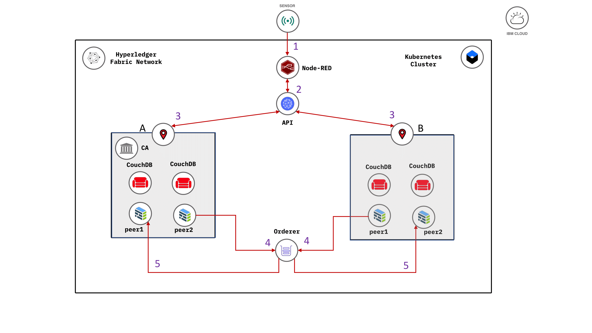

The README for a code pattern is very prescriptive, use the following template to get you started.

<!-- Put badges at the very top -->
<!-- Change the repo -->

<!-- Add a new Title and fill in the blanks -->
# Code patterns showing TDD in Node.js and containers

In this code pattern, we will show you how to create a world class microservice using NodeJS and Containers. Microservices are often not well defined or understood.  Micro does not refer to the number of lines of code for instance, actually a microservice can be have a large code base.  Essentialy what a micoroservice is:

* a representation of a business need ( e.g. Convert Currency value from one currency, say South African Rands [ZAR] to Pounds Sterling [GBP] using the most current daily exchange rate )  
* Isolated: a self contained unit of work, i.e. is not tightly coupled to any other dependancies in the system, for instance other microservices databases or any other shared resources. 
* a small useful `program`, like in UNIX small programs that can be run on their own, but also can be used in a pipeline or framework where it can produce powerful results (e.g. cat File | sed | awk | grep > &2<1 log.txt ) [ Jonas Boner = Reactive Microsystems ]

We will use the latest ( as of writing this pattern ) technologies used in NodeJS development:
#### 1) Version of JavaScript
[ECMA script](http://www.ecma-international.org/ecma-262/6.0/) (2015 ES6 or later)

#### 2) Testing Framework for Test Driven Development (TDD)
[Jest](https://jestjs.io/) unittest framework

#### 3) Best of breed tooling

*  Node Version Manager ([NVM](https://github.com/nvm-sh/nvm))
    * choose and swithc wich version of node and npm that suits your project 
        * don't use the system version ever! It may and probabbly will change and could affect you program.
        * don't change the system version, it could affect other programs, or even worse your operating system and cause your computer or Virtual Server to crash!
        * If you want to use mulitple different versions of node which is often required these days, NVM will be your friend!

* Testing frameworks

    * Jest for `Delightful` Unittesting 
        * use Jest mocks to run unit tests locally 
            * avoid side-effects
                * like calling external services that could have changes or be offline, like other web apis ( e.g. The World Bank currency exchange api our micro service wraps ) 
                * external databases that could be in-flux or even down as well
                * time stamps and random ID generation are non-determisitic, so not good for test data that may be generated on the fly ( mocks really shine here and provide expected reliable values that tests your business logic )
* Code formatting
    * Prettier 
    * git precommit hooks
* JavaScript syntax checking
    * [ESLint](https://eslint.org/)
        * Find and fix problems in your JavaScript code
* JavaScript Build Compiler
    * [Babel JS](https://babeljs.io/)
        * Use next generation JavaScript, today
            * Put ***in*** next-gen(latest and greatest) JavaScript and get cross browser-compatible JavaScript ***out***
* On page save hooks
    * run tests automatically using `Jest -watch`
* On commit pre-hooks
    * << tbd need to check - maybe python only? >>
* [`rimraf`](https://www.npmjs.com/package/rimraf)
    * Cleanup previous builds and distributions
        * rimraf is The UNIX command `rm -rf` for ***node***
* `swagger` 
    * by installing the npm package `swagger-ui-express` you can
    create a REST api with a well documented test harness with almost no effort at all, giving your microservice that professional and polished look as well as a useful way to manually test the API from a swagger html test harness.

When you have completed this code pattern, you will understand how to:

* How to use this simple microservice application as a basis to create awesome world class microservices using NodeJS and the latest version of ECMA Script
* The importance of Test Driven Development (TDD) and how by incorporating tests throughout the development - deploy lifecycle will make your life easier, coding fun and be confident that your application will run as best as possilbe even after code changes due to either new feature requests or bug fixes
* design and create a microservice with a REST interface that is documented with a test harness automatically provided by OpenAPI compliant [Swagger](https://swagger.io/) definitons, by just adding a simple swagger.yaml file!  
* [goal 3]
* [goal n]

<!--add an image in this path-->

<!--Optionally, add flow steps based on the architecture diagram-->
## Flow

1. Consumer calls our  microservice over the internet (http/s request)
2. ExpressJS `web server`   accepts the REST request (e.g. GET /convertCurrency/ZAR/USD/600.66)
3. Code routing in Express passes the request to a service module which in turn calls the European Currency Exchange API
4. An exchange rate for ZAR is retrieved and stored.  The value of 600.66 South African Rands (ZAR) is converted to US Dollars(USD)
5. The ExpressJS `web server` sends a response to the calling Consumer
with the dollar amount ( e.g. $40.59 )

<!--Optionally, update this section when the video is created-->
# Watch the Video
### Test Driven Devlopment (TDD) in action
<< here we can illustrate how a bug, was fixed using a best practice methodology that uses TDD as it's underpinning >>

# Steps
1. Setup NVM
1. Setup directories, and files (boilerplate/scaffolding)

    2.1 copy this project - from git for example or git pull from a template <<tbd>>
1. Install packages with NPM
1. Write unit tests for each feature you are adding

    4.1 Expect tests to break ( this is good at this point )

    4.2 Write business logic towards making the intial test to pass

    4.3 Continue and iterate until test pass!

    4.4 rinse lather and repeat!

1. CI/CD 
1. Travis setup in repo <<tbd ? who in team can help here? >>
1. Prepare microservice for deployment to Kubernetes or Openshift

    8.1. Dockerfile prep

    8.2 Create docker image and push to DockerHub or IKS

1. Deploy to IBM Cloud

    9.1 OpenShift v4

    9.2 Kubernetes

1. Functional - Smoke testing
1. QA testing
1. User acceptence testing
1. rinse lather and repeat! ( refine app goto step 4 )
