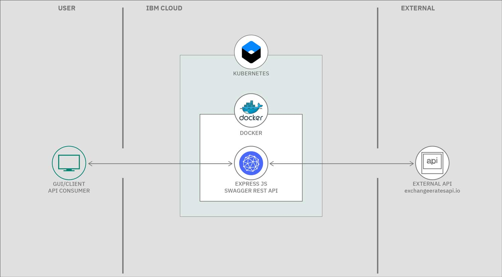

[](https://travis-ci.com/IBM/TDD-NodeJS-Containers)

# Test Driven Development (TDD) in Node.js

In this code pattern, we will show you how to create a world class currency conversion microservice using Test Driven Development (TDD) in Node.js.  This code pattern is a microservice that is a part of the [Bee Travels project](https://github.com/bee-travels)

TDD is a style of programming that closely intertwines coding, testing, and designing. To illustrate, when designing the functionality of your application, you would write unit-tests first then implement the code afterwards.

We will attempt to use and showcase modern Node.js development by using Modern JavaScript [ECMA script](http://www.ecma-international.org/ecma-262/) and popular NPM libraries - listed in the [Anatomy of this Application](#anatomy-of-this-application) section at the bottom of this page.

The JavaScript unit-test framework testing library we will use for TDD in this code pattern is [Jest](https://jestjs.io/).


### When you have completed this code pattern, you will understand how to:

* Develop using the Test Driven Development (TDD) methodology 
* Incorporate tests throughout the development lifecycle - deploy lifecycle will make your life easier, coding fun and be confident that your application will run as best as possible even after code changes due to either new feature requests or bug fixes are requested or found in QA
* Write test first that break - philosophy
* Design and create a microservice with a REST interface that is documented with a test harness automatically provided by OpenAPI connect aka [Swagger](https://swagger.io/) definitions, by just adding a simple swagger.yaml file!  
* Use this simple microservice application as a basis to create awesome world class microservices using Node.js and the latest version of JavaScript, ie ECMA Script.

## Unit-tests are the main type of tests on TDD
There are a number of types of tests in software; however, in TDD, unit-tests are the tests that we are concerned with.  Unit-tests are derived from feature requests or bug fixes and they are written first.  Consequently, unit-tests then become self documentation of the system.  

Jest Unit-Tests use the popular  `describe` `it` and `expect` syntax as seen here in [src/services/countryCurrencyCodeHandler.test.js](https://github.com/IBM/TDD-NodeJS-Containers/blob/master/src/services/countryCurrencyCodeHandler.test.js#L17-L26) 

It's important that unit-tests are deterministic (i.e. do not have side-effects) like calling an external API, so we use the use the concept of mocking data, which ensures that when tests run the expected results, they are `hard coded`. Thereby ensuring that tests do not use data that changes over time.  For example, the base currency rate for USD may be `8.11` today, but tomorrow it could be `8.45`.  An example of mock data may be seen in the test [src/services/serviceHandler.test.js](https://github.com/IBM/TDD-NodeJS-Containers/blob/master/src/services/serviceHandler.test.js#L11-L22)

## Code formatting
As part of this pattern we illustrate linting and formatting NPM scripts are in [package.json](https://github.com/IBM/TDD-NodeJS-Containers/blob/master/package.json#L13-L14)  
The linter is `eslint` and it can be called by running `npm run lint` and the formatter is `prettier` and can be run with `npm run format`.  These are not strictly speaking tests, but they do help one to catch syntax errors and format our code more elegantly.

## CI/CD - e.g. Travis or CircleCI

The unit tests that come out of TDD are also an integral part of the CI/CD process.  The tests are run in the deployment pipeline as seen [here](https://github.com/IBM/TDD-NodeJS-Containers/blob/master/.travis.yml). If all tests pass, integration and deployment will happen. On the other hand, if any tests fail, the process is halted, thus ensuring the `build is not broken`


## Design time Flow

It is during coding ( aka Design time ) that TDD is practiced.

### The Red-Green-Refactor process

The Red-Green-Refactor process is the core part of TDD, without it no other aspect of TDD will function.

Figure 1 below showing the steps that typically occur when working in 
a test driven way (aka Red-Green-Refactoring)


***figure 1: Red-Green-Refactoring***

1. Pick a story ( e.g. feature request  or bug/issue )
1. Write a unit-test that represents the story
1. Run the test, it will fail (RED)
1. Implement business logic towards making this test to pass
1. Run the test until it passes (GREEN)
1. Refactor business logic to improve code (TEAL)

The name comes from the status of the tests within the cycle. When in the red state, code does not work.  When in the green state everything is working, but not necessary in the most optimal way.  When in the teal phase we are refactoring phase where we are confident our code is covered with tests and thereby gives us the confidence to change and improve our code.


# Watch the Videos
### Test Driven Development (TDD) in action
Begin here. 

[video Setup this code-pattern and run it](https://youtu.be/r13OYhwYGa0)

***Video 1: From git repo to production***

See how a bug that surfaced during the actual production of this code base and how we
fixed it using TDD!

[video using TDD to fix a bug](https://www.youtube.com/watch?v=pzLJ1cMhnc8)

***Video 2: fixing a bug with TDD***


## Runtime Flow

This flow is for the runtime of the currency conversion microservice.




***figure 2: production flow***


1. Consumer calls the microservice over the internet (http/s request)
1. ExpressJS `web server`  accepts the REST request (e.g. GET /convertCurrency/ZAR/USD/600.66)
1. Code routing in Express passes the request to a service module which in turn calls the European Currency Exchange API
1. An exchange rate for ZAR is retrieved and stored.  The value of 600.66 South African Rands (ZAR) is converted to US Dollars(USD)
1. The ExpressJS `web server` sends a response to the calling Consumer
with the dollar amount ( e.g. $40.59 )

## Anatomy of this Application

The currency exchange micro-service uses the following libraries that could constitute the fabric in creating a modern JavaScript application:


### Design / Development time:

* Jest for `Delightful` Unit testing 
    * use Jest `mocks` to run unit tests locally without side-effects
        <details><summary>examples of side effects</summary>
            * like calling external services that could have changes or be offline, like other web apis ( e.g. The World Bank currency exchange api our micro service wraps ) 
            * external databases that could be in-flux or even down as well
            * time stamps and random ID generation are non-deterministic, so not good for test data that may be generated on the fly ( mocks really shine here and provide expected reliable values that tests your business logic )
    </details>

    * Hot code reloading (aka On page save hooks) run tests automatically on save by running `Jest -watch`

* Git pre-commit hooks ( every time you run `git commit ...` both the linter and formatter will run ) If for example you have extra spaces in your code like `const planet = " Saturn      ";` the formatter will automatically clean up the code and format it correctly to be `const planet = "Saturn";`.  This newly formatted code is then commited and can be pushed.  However say you have a syntax error, for example `cnst planet = "Saturn";` the commit will fail as the symbol `cnst` is invalid.  You will see informative output in your console as seen in figure 3 below.  Once you have manually corrected the syntax error you can re-commit it until syntax is correct and the linter passes.


***Figure 3. Syntax error caught by Git pre-commit hooks with both linter 1 (eslint) and formatter 2 (prettier)***


    * this is achieved with the two `npm` libraries `lint-staged` and `husky` , which are installed by running `npx` as such:

    ``` sh
        npx mrm lint-staged
    ```
    
    you will see the following automatically appended to the `package.json` file
    ``` json
        "husky": {
            "hooks": {
            "pre-commit": "lint-staged"
            }
        },
        "lint-staged": {
            "*.js": "eslint --cache --fix",
            "*.+(js|json)": "prettier --write"
        }
    ```


* Code formatting
    * Prettier 

* JavaScript syntax checking
    * [ESLint](https://eslint.org/)
        * Find and fix problems in your JavaScript code

* JavaScript Build Compiler (explore alt way)
    * [Babel JS](https://babeljs.io/)
        * Compiler for building
        * next generation JavaScript ( use import export and support of [Optional Chaining](https://v8.dev/features/optional-chaining) )


* [`rimraf`](https://www.npmjs.com/package/rimraf)
    * Cleanup previous builds and distributions
        * rimraf is The UNIX command `rm -rf` for ***node***

* `swagger` 
    * by installing the npm package `swagger-ui-express` you can create a REST api with a well documented test harness with almost no effort at all, giving your microservice that professional and polished look as well as a useful way to manually test the API from a swagger html test harness.


# Steps to run this code pattern

## run locally

1. Clone the repo by running `git clone TDD-NodeJS-Containers`
1. Ensure [Node.js](https://nodejs.org/en/) 10.16.1 later installed
by running `node -v`

<details><summary><strong>Recommendation use NVM to run Node</strong></summary>
Use Node Version Manager(NVM) to control the version of node you use, as the system or installed node may need to change from project to project on your local development environment.

Node Version Manager ([NVM](https://github.com/nvm-sh/nvm))
allows you to choose and switch which version of node and NPM that suits your project 

If you want to use multiple or different versions of node which is often required these days, NVM will be your friend!

</details>

1. Install packages with NPM by running `npm install`
1. Start the app by running  `npm start`
1. Browse the API from your browser `localhost:4001`

> Note: The server host can be changed as required in the server.js file, and `PORT` can be set in the `.env` file.


# Resources
[Using Test-Driven Development for Microservices by Bill Doerrfeld](https://nordicapis.com/using-test-driven-development-for-microservices/)

[Test-Driven Java Development, Second Edition: Invoke TDD principles for end-to-end application development, 2nd Edition by Farcic, Viktor](https://www.amazon.com/Test-Driven-Java-Development-Viktor-Farcic-ebook/dp/B00YSIM3SC)


# License

This code pattern is licensed under the Apache License, Version 2. Separate third-party code objects invoked within this code pattern are licensed by their respective providers pursuant to their own separate licenses. Contributions are subject to the [Developer Certificate of Origin, Version 1.1](https://developercertificate.org/) and the [Apache License, Version 2](https://www.apache.org/licenses/LICENSE-2.0.txt).

[Apache License FAQ](https://www.apache.org/foundation/license-faq.html#WhatDoesItMEAN)
